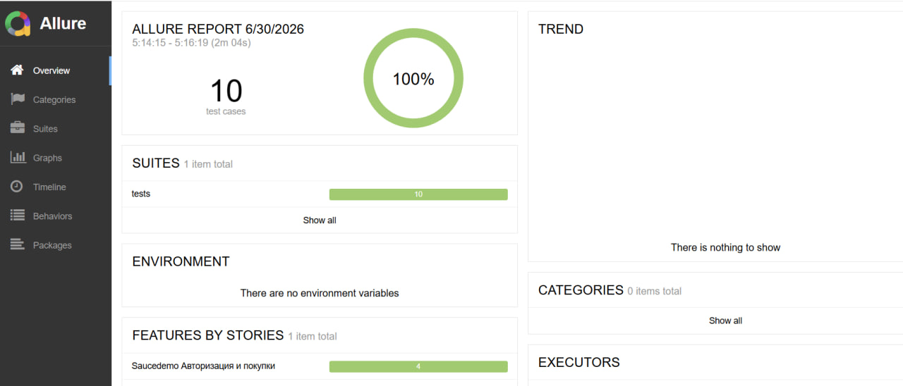

# Автоматическое тестирование Saucedemo

Проект с автоматизированными тестами сайта [**https://www.saucedemo.com/**](https://www.saucedemo.com/).

## Список тестов
Тест-кейсы описаны в файле [`test_8_lab.xlsx`](./test_8_lab.xlsx).  
Всего реализовано 10 автотестов, покрывающих основные сценарии

## Запуск тестов

### 1. Установка зависимостей
```bash
pip install -r requirements.txt
```

### 2. Запуск тестов
```bash
pytest tests/ --alluredir=allure-results
```

### 3. Генерация и просмотр Allure-отчёта
```bash
allure serve allure-results
```

## Результаты тестирования

